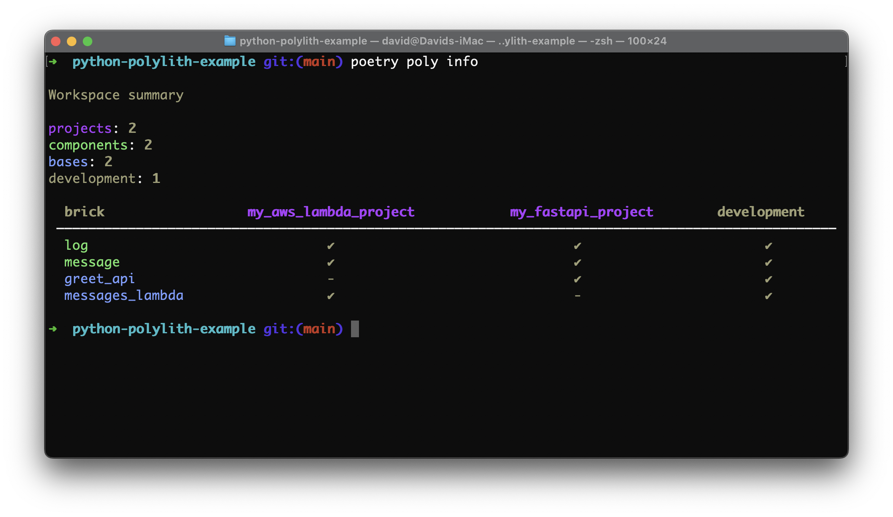

# Commands



## Create a workspace
This will create a Polylith workspace, with a basic Polylith folder structure.

#### Poetry
``` shell
poetry poly create workspace --name my_example_namespace --theme loose
```

#### Hatch
``` shell
hatch run poly create workspace --name my_example_namespace --theme loose
```

#### PDM
``` shell
pdm run poly create workspace --name my_example_namespace --theme loose
```

#### Rye
``` shell
rye run poly create workspace --name my_example_namespace --theme loose
```

#### uv
``` shell
uv run poly create workspace --name my_example_namespace --theme loose
```

#### Maturin

``` shell
# if not already activated a virtual environment
source .venv/bin/activate

poly create workspace --name my_example_namespace --theme loose
```

### Options
`--name` (required) the workspace name, that will be used as the single top namespace for all bricks. __Choose the name wisely.__
Have a look in [PEP-423](https://peps.python.org/pep-0423/#respect-ownership) for naming guidelines.

`--theme` the structure of the workspace (see below).

### Themes
Themes are an exclusive Python Polylith feature, and defines what kind of workspace structure to use.

#### loose (recommended)
A theme to use for a more familiar structure for Python: _components/namespace/package_ and will put a _test_ folder at the root of the repository.

#### tdd
The default and will set the structure according to the original Polylith Clojure implementation, such as:
_components/package/src/namespace/package_ with a corresponding _test_ folder.

#### What's the deal with the .keep files?
When creating a new workspace, the Polylith tool will add `.keep` files in the newly created folders.
These are added for any initial commits of the folder structure, and can safely be removed when adding source files.

## Create a component
This command will create a component - i.e. a Python package in a namespaced folder.

#### Poetry
``` shell
poetry poly create component --name my_example_component
```

#### Hatch
``` shell
hatch run poly create component --name my_example_component
```

#### PDM
``` shell
pdm run poly create component --name my_example_component
```

#### Rye
``` shell
rye run poly create component --name my_example_component
```

#### uv
``` shell
uv run poly create component --name my_example_component
```

#### Maturin
``` shell
# if not already activated a virtual environment
source .venv/bin/activate

poly create component --name my_example_component
```

### Options
`--name` (required) the name of the component.

`--description` adding a docstring to the base.
It will also be added in the README, when enabled in the configuration. See [configuration](configuration.md).

## Create a base
This command will create a base - i.e. a Python package in a namespaced folder.

#### Poetry
``` shell
poetry poly create base --name my_example_base
```

#### Hatch
``` shell
hatch run poly create base --name my_example_base
```

#### PDM
``` shell
pdm run poly create base --name my_example_base
```

#### Rye
``` shell
rye run poly create base --name my_example_base
```

#### uv
``` shell
uv run poly create base --name my_example_base
```

#### Maturin
``` shell
# if not already activated a virtual environment
source .venv/bin/activate

poly create base --name my_example_base
```

### Options
`--name` (required) the name of the base.

`--description` adding a docstring to the base.
It will also be added in the README, when enabled in the configuration. See [configuration](configuration.md).

## Create a project
This command will create a project - i.e. a pyproject.toml in a project folder.

#### Poetry
``` shell
poetry poly create project --name my_example_project
```

#### Hatch
``` shell
hatch run poly create project --name my_example_project
```

#### PDM
``` shell
pdm run poly create project --name my_example_project
```

#### Rye
``` shell
rye run poly create project --name my_example_project
```

#### uv
``` shell
uv run poly create project --name my_example_project
```

#### Maturin
``` shell
# if not already activated a virtual environment
source .venv/bin/activate

poly create project --name my_example_project
```

### Options
`--name` (required) the name of the project.

`--description` adding a _pyproject.toml_ description.


## Info
Show info about the workspace:

#### Poetry
``` shell
poetry poly info
```

#### Hatch
``` shell
hatch run poly info
```

#### PDM
``` shell
pdm run poly info
```

#### Rye
``` shell
rye run poly info
```

#### uv
``` shell
uv run poly info
```

#### Maturin
``` shell
# if not already activated a virtual environment
source .venv/bin/activate

poly info
```

### Options
`--short` Display a view that is better adjusted to Workspaces with many projects.

## Diff
Shows what has changed since the most recent stable point in time.

The `diff` command will compare the current state of the repository, compared to a `git tag`.
The tool will look for the latest tag according to a certain pattern, such as `stable-*`.
The pattern can be configured in the Workspace [configuration](configuration.md).

The `diff` command is useful in a CI environment, to determine if a project should be deployed or not.
It is also useful when running tests for changed bricks only.

#### Poetry
``` shell
poetry poly diff
```

#### Hatch
``` shell
hatch run poly diff
```

#### PDM
``` shell
pdm run poly diff
```

#### Rye
``` shell
rye run poly diff
```

#### uv
``` shell
uv run poly diff
```

#### Maturin
``` shell
# if not already activated a virtual environment
source .venv/bin/activate

poly diff
```

### Options
`--short` Useful for determining what projects has been affected by the changes in CI.

`--bricks` Useful for displaying changed bricks only. It will print a comma-separated list of bricks when using it with the `--short` option.

`--since` Useful for displaying changes since a `stable` or `release` tag.
The tag patterns are defined in the Workspace [configuration](configuration.md).
This option also support using a specific commit hash.

`--deps` Useful for displaying the bricks that are used by the changed bricks. Use it with the `--bricks` option.

## Libs
Show info about the third-party libraries used in the workspace:

#### Poetry
``` shell
poetry poly libs
```

This feature relies on installed project dependencies, and expects a `poetry.lock` of a project to be present.
If missing, there is a Poetry command available:
``` shell
poetry lock --directory path/to-project
```

#### Hatch
``` shell
hatch run poly libs
```

#### PDM
``` shell
pdm run poly libs
```

#### Rye
``` shell
rye run poly libs
```

#### uv
``` shell
uv run poly libs
```

#### Maturin
``` shell
# if not already activated a virtual environment
source .venv/bin/activate

poly libs
```

### Options
`--directory`
Show info about libraries used in a specific project.

`--strict`
A more narrow way of comparing third-party libraries and the actual imports.
This is useful to rule out possible false positives.

`--alias`
Useful when an import differ from the library name.

Example: the library "opencv-python" and the actual import "cv2".
The poly libs command will likely report the "cv2" as a missing dependency.

Using `--alias opencv-python=cv2` will make the command treat the alias as a third-party import.


## Check
Validates the Polylith workspace, checking for any missing dependencies (bricks and third-party libraries):

#### Poetry
``` shell
poetry poly check
```

This feature is built on top of the `poly libs` command,
and for expects a `poetry.lock` of a `Poetry` project to be present.

#### Hatch
``` shell
hatch run poly check
```

#### PDM
``` shell
pdm run poly check
```

#### Rye
``` shell
rye run poly check
```

#### uv
``` shell
uv run poly check
```

#### Maturin
``` shell
# if not already activated a virtual environment
source .venv/bin/activate

poly check
```

### Options
`--directory`
Show info about libraries used in a specific project.

`--strict`
A more narrow way of comparing third-party libraries, versions and the actual imports.
This is useful to rule out possible false positives,
and to ensure using the same version strings for the libraries across the workspace.

`--alias`
Useful when an import differ from the library name.

Example: the library "opencv-python" and the actual import "cv2".
The poly check command will likely report the "cv2" as a missing dependency.

Using `--alias opencv-python=cv2` will make the command treat the alias as a third-party import.


## Sync
Keep projects in sync with the actual usage of bricks in source code.

#### Poetry
``` shell
poetry poly sync
```

#### Hatch
``` shell
hatch run poly sync
```

#### PDM
``` shell
pdm run poly sync
```

#### Rye
``` shell
rye run poly sync
```

#### uv
``` shell
uv run poly sync
```

#### Maturin
``` shell
# if not already activated a virtual environment
source .venv/bin/activate

poly sync
```

This feature is useful for keeping projects in sync. The command will analyze code and add any missing bricks to the projects, including the development project.

- projects: will add missing bricks to the project specific _pyproject.toml_, when imported by any of the already added bricks.
- development: will add __all__ missing bricks to the development _pyproject.toml_.

### Options
`--directory`
Synchronize a specific project.


## Deps
Show dependencies between bricks.

#### Poetry
``` shell
poetry poly deps
```

#### Hatch
``` shell
hatch run poly deps
```

#### PDM
``` shell
pdm run poly deps
```

#### Rye
``` shell
rye run poly deps
```

#### uv
``` shell
uv run poly deps
```

#### Maturin
``` shell
# if not already activated a virtual environment
source .venv/bin/activate

poly deps
```

### Options
`--directory`
Show brick depencencies for a specific project.

`--brick`
A detailed view for a single brick and the dependent bricks: used by, and uses.

## Test
Polylith doesn't have its own test runner. Use your favorite testing tool, such as `pytest`.

With this command, You can identify the bricks and projects that are _affected_ by changes in tests.
The `poly test` command is used with a sub-command: __poly test diff__.
It will show you any affected bricks or projects a test is modified.

Tests are expected to live in a test folder at the Workspace root when using the recommended __loose__ theme.
For users of the __tdd__ theme, the tests are expected to be found in the brick test folder.

#### Poetry
``` shell
poetry poly test diff
```

#### Hatch
``` shell
hatch run poly test diff
```

#### PDM
``` shell
pdm run poly test diff
```

#### Rye
``` shell
rye run poly test diff
```

#### uv
``` shell
uv run poly test diff
```

#### Maturin
``` shell
# if not already activated a virtual environment
source .venv/bin/activate

poly test diff
```

### Options
`--short` Useful for determining what projects has been affected by the changes in CI.

`--bricks` Useful for displaying affected bricks only. It will print a comma-separated list of bricks when using it with the `--short` option.

`--projects` Useful for displaying affected projects only. It will print a comma-separated list of projects when using it with the `--short` option.

`--since` Useful for displaying changes since a `stable` or `release` tag.
The tag patterns are defined in the Workspace [configuration](configuration.md).
This option also support using a specific commit hash.


## Running tests
See the [testing](testing.md) section for examples on how to run __pytest__ for changed bricks only.
