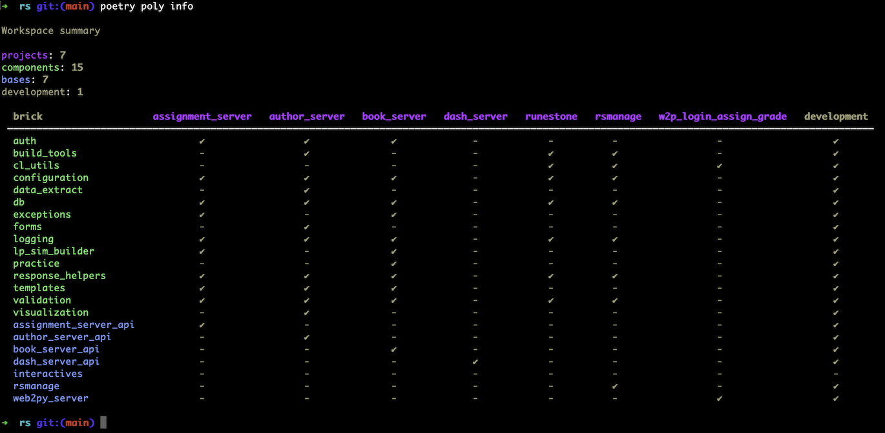

# Examples & Production Systems

## Example code repositories
Here are some examples of how to setup __Python__ with the Polylith Architecture.

- Python Polylith Example Monorepo
    - [for Poetry](https://github.com/DavidVujic/python-polylith-example)
    - [for Hatch](https://github.com/DavidVujic/python-polylith-example-hatch)
    - [for PDM](https://github.com/DavidVujic/python-polylith-example-pdm)
    - [for Rye](https://github.com/DavidVujic/python-polylith-example-rye)
    - [for Pants](https://github.com/DavidVujic/python-polylith-example-pants)
    - [for uv](https://github.com/DavidVujic/python-polylith-example-uv)
    - [for Pixi](https://github.com/FloLangenfeld/python-polylith-example-with-pixi) by Florent Lagenfeld
- [Python Polylith Microservices Example](https://github.com/ttamg/python-polylith-microservices-example) by Matt Gosden
- [Aws CDK App with Polylith](https://github.com/ybenitezf/cdk_polylith) by Yoel Benítez Fonseca

You will find examples of sharing code between different kind of projects, developer tooling configuration such as `mypy` and the `venv`,
and development setup for REPL Driven Development or Jupyter notebooks.

## Production Systems

### Runestone Academy
> Runestone Academy is an open-source project and our mission is to equip the nation's STEM teachers with open-source content, tools and strategies they need to create engaging, accessible, and effective learning experiences for their students. 

[Runestone Academy Monorepo](https://github.com/RunestoneInteractive/rs)

### BritNed
> [BritNed](https://www.britned.com/) - Electricity interconnector, connecting the United Kingdom with the European mainland through the Netherlands. Polylith-Python is the foundation under our (internal) data warehouse which extracts/transforms data from multiple systems in our operation.

### Attendi
> [Attendi](https://attendi.nl/) - Provides speech-driven and natural language reporting APIs for healthcare professionals and electronic health records, transforming screen time into valuable moments together with their patients.

How Attendi use Polylith: [Moving all our Python code to a monorepo: pytendi](https://attendi.nl/moving-all-our-python-code-to-a-monorepo-pytendi/)

## Other
In addition to the examples and Production Systems,
there is also the actual [Python tools for the Polylith Architecture](https://github.com/DavidVujic/python-polylith)
repo, that itself is a Polylith Workspace.

### Your project here?
Do you have a Polylith repository that you or your company would like to share here? You are very much welcome to make a Pull Request,
or create a Github issue to the [python-polylith-docs](https://github.com/DavidVujic/python-polylith-docs) repo.
