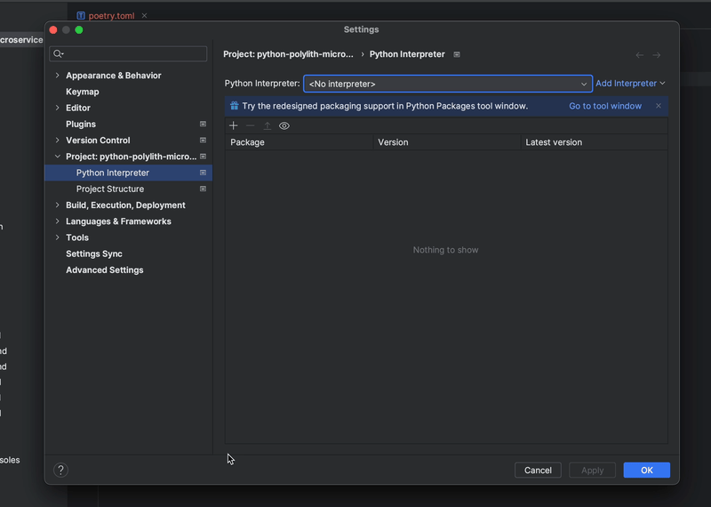

# Configuring your Python IDE

## MyPy

Add this configuration if you use MyPy for static analysis. With this configuration,
namespace packages will be enabled and top-level packages will be based in the `mypy_path` option.


```toml
[mypy]
mypy_path = components, bases
namespace_packages = True
explicit_package_bases = True
```

## Pyright

Pyright users can add this setting to make the tool aware of the `components` and `bases` folders.

`.vscode/settings.json`

```json
{
  "python.analysis.extraPaths": [
    "bases",
    "components"
  ]
}
```

`pyproject.toml`

```toml
[tool.pyright]
extraPaths = ["bases", "components"]
```


## .venv
It is recommended to create the virtual environment locally, for a great code editor experience.
By default, `Poetry` will create a `venv` outside of the repo. You can override that behaviour by adding a configuration in a `poetry.toml` file:

``` toml
[virtualenvs]
path = ".venv"
in-project = true
```

## PyCharm
Make sure that you have a local virtual environment configuration (see above).

Run `poetry install` in a shell.

This will install the dependencies, and make the environment aware of the `bases` and `components` folders.
PyCharm will ask about what interpreter to use when opening a Python file. Make sure to choose the local one in the `.venv` folder.

Everything should now be set up correctly for PyCharm!


