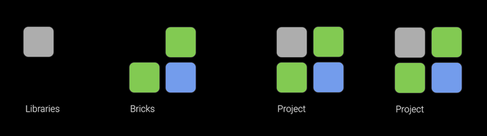
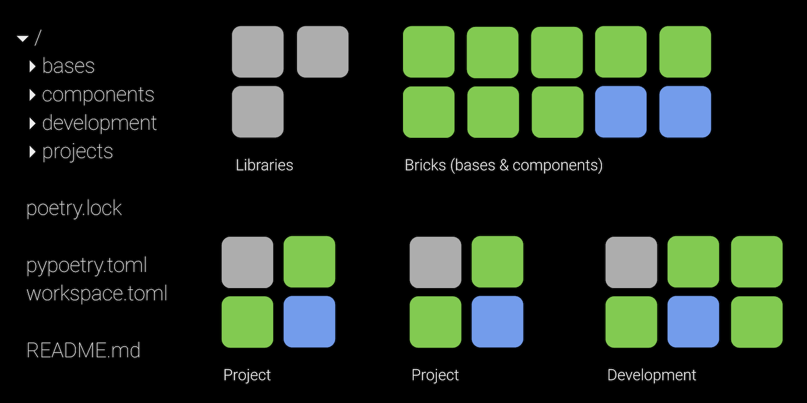

# What's Polylith?

> :material-information: For a more visual quickstart, check out the short videos in the [Videos & tutorials](videos.md) section.

__The main use case__ is to support having one or more microservices (or apps) in a Monorepo, and share code between the services.

Polylith is an architecture, with useful tooling support.  The purpose of this architecture is a great Developer Experience for both Humans and Agents.
In Polylith, code is like building blocks. Very much like LEGO bricks.
The code lives in a well-structured Monorepo, having code organized into smaller reusable parts with clear boundaries between them.
Python code - the bricks - has a clear separation from the infrastructure and the actual packaging or building of the deployable artifacts.

### What is a Brick?
In Python, a file is a module. One or more modules in a folder is a package. One or more packages can be combined into a feature. In Polylith, this is called _bricks_, and there are two types of them: __components__ and __bases__.

Components are the main building blocks in Polylith. This is where the business logic lives, the actual features and functionality. Components are the ones you will share among the apps or services in the Monorepo. Bases are the entry points to your apps or services. A base should ideally be thin, and delegate the business logic to components.

#### What is a Brick Interface?
The way the Polylith tool identifies a brick interface is by analyzing the contents of the `__init__.py` module. All imported things, variables, classes and functions in the `__init__.py` module is part of the brick interface (unless marked as "private" using the `_` convention).

## What problems does the Polylith Architecture solve?
Polylith offers a solution to the Microservice vs Monolith tradeoffs. Microservices are great,
but the standard kind of setup will probably introduce a new set of problems:

- Source code is spread out in several repositories.
- Duplicated code.
- Shared code need to be packaged as libraries - that means even more repositories.
- Microservices running different versions of tools and dependencies, potentially also different Python versions.

Phew, that's a lot to maintain. For Agents too.

Polylith addresses these types of issues, with simple solutions.
Polylith is very much about the Developer Experience.
The setup is great for Test and REPL Driven Development - a workflow that makes coding both joyful and interactive.
If you're into Agentic Engineering: agents will have all the necessary context in one single place, in one environment. An agent can use the `poly` tool during development, just like a human would.

> If you can improve just one thing in your software development, make it getting faster feedback. [^1]

This type of Architecture will also let you postpone design decisions if you like, such as going for a Monolith or REST Microservices or Serverless functions.
Your team can instead choose to focus on the code and features. Make the decisions on _how to deploy_ when you are ready for it.

## Well suited for Monorepos
Polylith is about:

- Code as small composable bricks that you combine into features
- Making it easy to share code across apps, tools, serverless functions and services
- Keeping it simple

## Polylith for Python?
The __Python tools for the Polylith Architecture__ is available as two options:

- A standalone CLI supporting __uv__, __Hatch__, __PDM__, __Rye__, __Pantsbuild__, __Maturin__ and __Pixi__ (and Poetry).
- A __Poetry__ plugin. The plugin will add Polylith specific features to Poetry.

### Use cases

#### Microservices and apps
The main use case is to support having one or more microservices (or apps) in a Monorepo, and share code between the services.

#### Libraries
Polylith for Python has support for building libraries to be published at PyPI, even if it isn't the main use case.
More details about how to package libraries in [Packaging & deploying](deployment.md).

## Structure for simplicity
Organizing, sorting and structuring things is difficult.

> There should be one-- and preferably only one --obvious way to do it. [^2]

A good directory structure is one that makes it simple to reuse existing code and makes it easy to add new code.
You shouldn't have to worry about these things. The Polylith Architecture offers a way to organize code that is simple,
framework agnostic and scalable as projects grow.

See [The Polylith Workspace](workspace.md) for how such a structure looks like.

### Simple is better
The main takeaway is to view code as small, reusable bricks, that ideally does one thing only.
A brick is not the same thing as a library. So, what's the difference? Well, a library is a full blown feature. A brick can be a single function, or a parser. It can also be a thin wrapper around a third party tool.

> Simple is better than complex. [^2]

In Python, a file is a module. One or more modules in a directory becomes a package.
A good thing with this is that the code will be namespaced when importing it.
Where does the idea of bricks fit in here? Well, a brick is a Python namespace package. Simple as that.

> Namespaces are one honking great idea -- let's do more of those! [^2]

If you want to dig a bit deeper, you will find a lot more information about the Polylith Architecture in general from the [Polylith Architecture docs](https://polylith.gitbook.io/polylith/):
>... Polylith is a software architecture that applies functional thinking at the system scale. It helps us build simple, maintainable, testable, and scalable backend systems. ...

[^1]: Dave Farley [on twitter](https://twitter.com/davefarley77/status/1560724029924786177?s=12&t=KxEN15qtnJODJUzkmclzmw)
[^2]: From the Zen of Python
